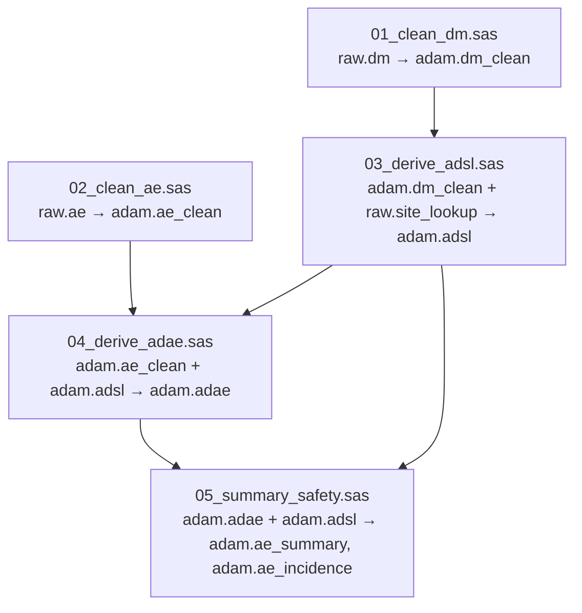
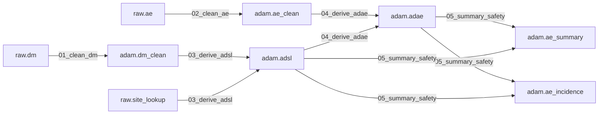
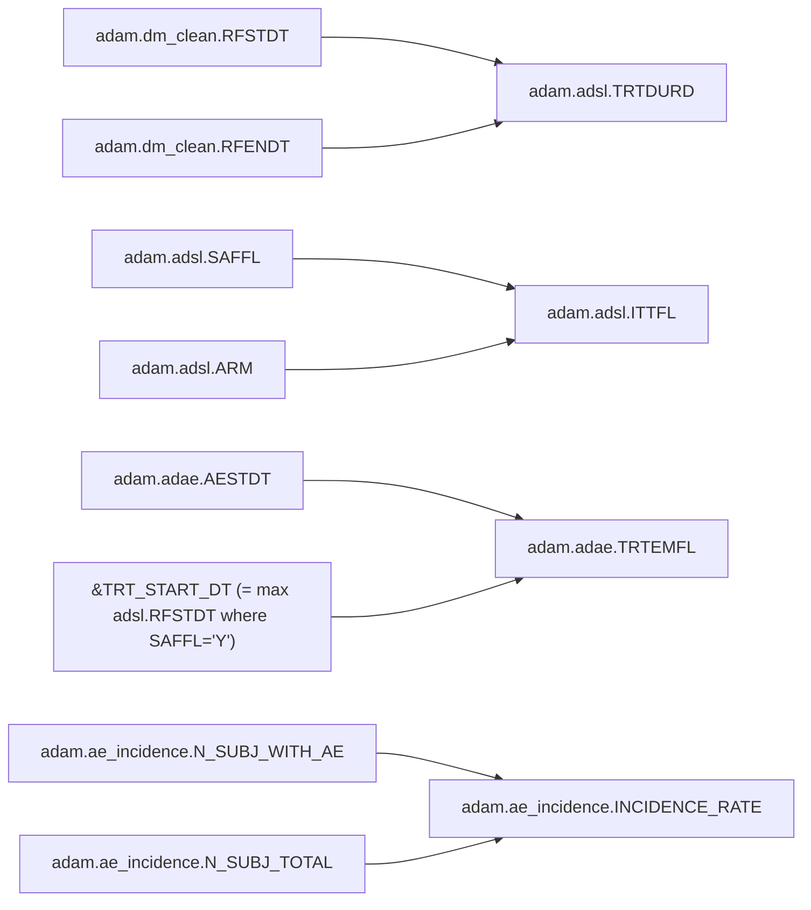

# SAS Modernization — Solution Document

> **Status:** Living document, updated incrementally as the 5-phase pipeline executes.
> **Last updated:** 2026-05-07

## 1.1 Executive summary

A 533-line SAS clinical-trials pipeline (5 programs, 1 macro file, 1 format
catalog) was modernized into Python (pandas + duckdb) via a 5-phase
graph-driven workflow: parse SAS → parse docs → build a 173-node knowledge
graph → regenerate functional specs / schemas / DAG / pytest stubs from
the graph alone → generate target code from those specs only. The
generated pipeline runs end-to-end (`python build/dag/run.py`) and produces
all 6 ADaM outputs that match `ground_truth/*.csv` row-for-row, schema and
column order intact (23/23 pytest assertions green: 18 row-equality + 5
aggregate reconciliation). One High-severity static-analysis ambiguity —
the cross-program `&TRT_START_DT` macro coupling — was raised at the
checkpoint and resolved by the user before Phase 5; five Medium/Low
ambiguities were auto-logged with documented assumptions, including one
(AGE_DERIVED `//365` vs `floor(/365.25)`) discovered during validation
and registered post-hoc per the hybrid policy. Confidence in the result:
**high** for this synthetic codebase; the production-rollout caveats are
in §1.9.

## 1.2 Codebase inventory

Snapshot of the SAS estate at parse time, derived from
`build/ast/_aggregate/counts.json`.

### 1.2.1 Files

| Group     | File                                          | Lines | DATA | PROC | Procs by kind         |
| --------- | --------------------------------------------- | ----: | ---: | ---: | --------------------- |
| config    | `sas_codebase/config/setup.sas`               |    25 |    0 |    0 | —                     |
| config    | `sas_codebase/config/formats.sas`             |    58 |    0 |    1 | format ×1             |
| macros    | `sas_codebase/macros/util_macros.sas`         |    71 |    0 |    0 | —                     |
| program   | `sas_codebase/programs/01_clean_dm.sas`       |    79 |    3 |    1 | sort ×1               |
| program   | `sas_codebase/programs/02_clean_ae.sas`       |    95 |    4 |    3 | sort ×3               |
| program   | `sas_codebase/programs/03_derive_adsl.sas`    |    66 |    2 |    2 | sql ×2                |
| program   | `sas_codebase/programs/04_derive_adae.sas`    |    63 |    2 |    2 | sort ×2                |
| program   | `sas_codebase/programs/05_summary_safety.sas` |    76 |    0 |    6 | sql ×4, sort ×1, summary ×1 |
| **total** | **8 files**                                   | **533** | **11** | **15** | format ×1, sort ×7, sql ×6, summary ×1 |

### 1.2.2 Macros

| Macro                    | Params              | Reads globals  | Writes globals | Source                                    |
| ------------------------ | ------------------- | -------------- | -------------- | ----------------------------------------- |
| `iso_to_sasdate`         | `var=`              | —              | —              | `util_macros.sas:19`                      |
| `calc_age`               | `birth=, ref=`      | —              | —              | `util_macros.sas:30`                      |
| `is_treatment_emergent`  | `ae_start=`         | **`TRT_START_DT`** | —          | `util_macros.sas:46`                      |
| `sev_to_rank`            | `sev=`              | —              | —              | `util_macros.sas:56`                      |
| `safe_div`               | `num=, den=`        | —              | —              | `util_macros.sas:69`                      |

`is_treatment_emergent` reads the global `&TRT_START_DT`, which is **written**
by `03_derive_adsl.sas` via `proc sql ... select max(rfstdt) into :TRT_START_DT`.
This is the cross-program coupling flagged in §1.5.

### 1.2.3 Datasets

| Library | Dataset             | Producer program             | Role               |
| ------- | ------------------- | ---------------------------- | ------------------ |
| raw     | `dm`                | (input)                      | demographics raw   |
| raw     | `ae`                | (input)                      | adverse events raw |
| raw     | `site_lookup`       | (input)                      | site reference     |
| adam    | `dm_clean`          | `01_clean_dm.sas`            | cleaned DM         |
| adam    | `ae_clean`          | `02_clean_ae.sas`            | cleaned AE + AESEQ + max severity |
| adam    | `adsl`              | `03_derive_adsl.sas`         | subject-level analysis dataset |
| adam    | `adae`              | `04_derive_adae.sas`         | AE analysis dataset |
| adam    | `ae_summary`        | `05_summary_safety.sas`      | event counts × arm × severity |
| adam    | `ae_incidence`      | `05_summary_safety.sas`      | subject-level incidence rates |

`work.*` transient datasets (8 in total — `dm_stage`, `dm_dedup`, `ae_stage`,
`ae_seq`, `ae_for_max`, `ae_max_sev`, `dm_with_site`, `adsl_pre`,
`adsl_sub`, `ae_sorted`, `adae_pre`, `denom`, `ae_subj`, `ae_counts`) are
recorded in the per-program DFGs but are not surfaced here.

## 1.3 Dependency graph

_Populated by Phases 1 and 3._

### 1.3.1 Program-level DAG

Edges derived from cross-program output→input dataset relationships.
Source: `build/ast/_aggregate/program_dag.json`.

**Non-obvious edges.** Beyond the dataset-driven edges shown above, there is a
*hidden* coupling from `04_derive_adae.sas` and `05_summary_safety.sas` back to
`03_derive_adsl.sas` via the global macro variable `&TRT_START_DT`. This
variable is set inside an SQL `select … into :TRT_START_DT` and is read by the
`%is_treatment_emergent` macro that 04 invokes. The dataset DAG does not
expose this — only the macro-table audit (§1.2.2) does. Treated as a
High-severity ambiguity (§1.5).

### 1.3.2 Dataset-level lineage

Each edge is a `produces` relationship; the label is the program that owns
the transformation. Source: `build/graph/kg.json` (edges of kind
`contributes_to` between Dataset nodes).

**Non-obvious edges.** Two: (i) the SAS-implicit char↔num join between
`adam.dm_clean.SITEID` and `raw.site_lookup.SITE_ID` carried inside the
`03_derive_adsl` edge — modernized code must coerce explicitly (see §1.5
#3); (ii) `adsl → ae_summary, ae_incidence` is mediated *only* by the
denominator subquery (`select count(distinct usubjid)... where saffl='Y'`),
not by a normal join — easily missed if you only inspect the SQL `from`
clauses.

### 1.3.3 Column-level lineage (selected critical columns)

Five columns critical to the safety analyses. Each row shows the immediate
upstream columns and the operation; full traversal lives in the graph.

| Output column                       | Operation                                                                  | Upstream columns                                                       | Source              |
| ----------------------------------- | -------------------------------------------------------------------------- | ---------------------------------------------------------------------- | ------------------- |
| `adam.adsl.TRTDURD`                 | `RFENDT - RFSTDT + 1`                                                      | `adam.dm_clean.RFSTDT`, `adam.dm_clean.RFENDT`                         | `01_clean_dm.sas:34` |
| `adam.adsl.ITTFL`                   | `'Y' if SAFFL='Y' and ARM≠'PLACEBO' else 'N'`                              | `adam.adsl.SAFFL`, `adam.adsl.ARM`                                     | `03_derive_adsl.sas:40` |
| `adam.ae_clean.MAX_AESEV`           | `last.usubjid` after sort by `(usubjid, aesevn)`; renamed from `aesev_std` | `adam.ae_clean.AESEV_STD`, `adam.ae_clean.AESEVN`                      | `02_clean_ae.sas:60` |
| `adam.adae.TRTEMFL`                 | `'Y' if AESTDT ≥ &TRT_START_DT and AESTDT not missing else 'N'`            | `adam.adae.AESTDT`, **runtime macro** `&TRT_START_DT` (= cohort `max(adam.adsl.RFSTDT)` over `SAFFL='Y'`) | `04_derive_adae.sas:38` (macro at `util_macros.sas:46`) |
| `adam.ae_incidence.INCIDENCE_RATE`  | `safe_div(N_SUBJ_WITH_AE, N_SUBJ_TOTAL)` rounded to 4 dp                   | `adam.ae_incidence.N_SUBJ_WITH_AE`, `adam.ae_incidence.N_SUBJ_TOTAL`   | `05_summary_safety.sas:53` |

**Non-obvious edges.** `TRTEMFL` has a non-column upstream (the runtime
macro `&TRT_START_DT`), which is the cross-program coupling registered in
§1.5 #1. The graph carries this as a `Macro.reads_globals=['TRT_START_DT']`
edge from `is_treatment_emergent` to a synthetic global symbol — a real
production graph would replace this with a per-subject `RFSTDT` lookup
once SP-227 is resolved.

## 1.4 Knowledge graph schema and statistics

Source: `build/graph/kg_stats.json`. Backend: `networkx.MultiDiGraph`,
serialized to `build/graph/kg.json` in node-link form. Queryable via
`build/graph/query.py`.

### 1.4.1 Schema

| Node kind      | Required attributes                                                       |
| -------------- | ------------------------------------------------------------------------- |
| `Dataset`      | `library`, `name`, `producer`, `source_csv`                              |
| `Column`       | `dataset`, `name`, `dtype`, `nullable`, `samples`                         |
| `Proc`         | `program`, `proc_kind`, `proc_name`, `label`, `line_start`, `line_end`    |
| `Macro`        | `name`, `params`, `reads_globals`, `writes_globals`, `source_file`, `source_line` |
| `Program`      | `name`                                                                    |
| `BusinessRule` | `text`, `source_file`, `source_section`, `source_line`                    |
| `OpenIssue`    | `id`, `tickers`, `text`, `source_file`, `source_section`, `source_line`   |
| `Constraint`   | `text`, `constraint_kind`                                                 |

| Edge kind         | From → To                          | Notes                                      |
| ----------------- | ---------------------------------- | ------------------------------------------ |
| `reads`           | Proc → Dataset                     |                                            |
| `writes`          | Proc → Dataset / Proc → Column     | Column writes propagated through `work.*`  |
| `contributes_to`  | Dataset → Dataset                  | Annotated with `via_program`               |
| `calls`           | Program → Macro                    | Annotated with `line`                      |
| `depends_on`      | Program → Program                  | Annotated with `via_dataset`               |
| `applies_to`      | BusinessRule → Dataset             |                                            |
| `flagged_by`      | Dataset / Column → OpenIssue       |                                            |
| `validates`       | Constraint → Column / Dataset      |                                            |

### 1.4.2 Counts

| Node kind     | Count | | Edge kind        | Count |
| ------------- | ----: |-| ---------------- | ----: |
| Dataset       |     9 | | reads            |     9 |
| Column        |    99 | | writes           |    24 |
| Proc          |    25 | | contributes_to   |    10 |
| Macro         |     5 | | calls            |     9 |
| Program       |     5 | | depends_on       |     5 |
| BusinessRule  |    17 | | applies_to       |    14 |
| OpenIssue     |     4 | | flagged_by       |     8 |
| Constraint    |     9 | | validates        |    14 |
| **total**     | **173** | | **total**        |  **93** |

### 1.4.3 Most-connected nodes

| Rank | Node                                  | Kind     | Degree |
| ---: | ------------------------------------- | -------- | -----: |
| 1    | `adam.adsl`                            | Dataset  |     12 |
| 2    | `adam.ae_clean`                        | Dataset  |      8 |
| 3    | `adam.dm_clean`                        | Dataset  |      7 |
| 4    | `adam.adae`                            | Dataset  |      7 |
| 5    | `raw.site_lookup`                      | Dataset  |      6 |
| 6    | `05_summary_safety::b10` (PROC SQL)    | Proc     |      5 |
| 7    | `05_summary_safety::b11` (PROC SQL)    | Proc     |      5 |
| 8    | `macro::iso_to_sasdate`                | Macro    |      5 |
| 9    | `PROGRAM:01_clean_dm`                   | Program  |      5 |
| 10   | `issue::functional_spec-§6.4` (SITE_ID) | OpenIssue |     5 |

`adam.adsl` is the central hub: every downstream dataset (`adae`,
`ae_summary`, `ae_incidence`) depends on it, and it bundles the runtime
side-effect (`&TRT_START_DT`) that propagates to the AE pipeline.

## 1.5 Ambiguity register

Static-analysis ambiguities detected during Phases 1–2. Per the user's chosen
hybrid policy (CLAUDE.md §0.2 Q4), High items pause for user resolution before
Phase 5; Low/Medium are batch-logged with documented assumptions.
Full write-ups for High items live in `build/reports/ambiguity_log.md`.

| # | Location | Ambiguity | Resolution | Severity | Source |
|---|----------|-----------|------------|----------|--------|
| 1 | `util_macros.sas:46` + `04_derive_adae.sas:38` (`&TRT_START_DT`) | `%is_treatment_emergent` reads a runtime global set inside an SQL `select … into :TRT_START_DT` in `03_derive_adsl.sas:46`. Static analysis cannot decide whether this is "first dose date" (per spec §4.4) or "cohort-level latest randomization date" (per the implementation). | **Resolved (user, 2026-05-07)** — adopt the cohort-level `max(rfstdt)` over `SAFFL='Y'` subjects, matching the running SAS implementation and ground truth. SP-227 follow-up remains for v1.4. | High | static analysis (Phase 1) + spec §6.3 (Phase 2) |
| 2 | `functional_spec.md §6.2` (SP-184) | ~5% of raw `AESEV` arrives as `GRADE 1/2/3` from vendor B; mapping is **deferred to v1.4**. The current code leaves `AESEV_STD` blank for those records, which produces the blank-severity rows visible in `ground_truth/ae_summary.csv`. | Logged. Phase 5 codegen replicates the deferred behaviour: `GRADE *` values produce blank `AESEV_STD`, no remapping. | Medium | spec §6.2 (Phase 2) + input-data scan (10 distinct `AESEV` values, incl. `GRADE 1`, `GRADE 2`) |
| 3 | `functional_spec.md §6.4` + `03_derive_adsl.sas:26` | DM `SITEID` is `char(2)` with leading zeros; `SITE_LOOKUP.SITE_ID` is `num`. SAS's PROC SQL does an implicit type-cast on join. Python/pandas/duckdb will not. | Logged. Phase 5 codegen explicitly casts `SITE_LOOKUP.SITE_ID` to a zero-padded 2-char string before the left join, preserving the `SITEID='02'` form in the output. | Medium | spec §6.4 (Phase 2) + Phase 1 PROC SQL parse |
| 4 | `functional_spec.md §6.1` | DM raw extract may contain duplicate subjects from a 2023 CRF amendment; resolved by sort-and-`first.usubjid` dedup in `01_clean_dm.sas:41-49`. | Logged. Phase 5 spec inherits the same dedup rule. No action required. | Low | spec §6.1 (Phase 2) + Phase 1 |
| 5 | `setup.sas:16` (`%sysfunc(getoption(SASUSER))`) | `&PROJ_ROOT` derives from a runtime SAS option that has no Python equivalent. Affects only `libname` paths and `%include` resolution — both purely cosmetic in the modernized pipeline (paths are project-relative). | Logged. Phase 5 codegen ignores `&PROJ_ROOT`; the runner uses the project root computed at script start. | Low | static analysis (Phase 1) |
| 6 | `util_macros.sas:31` `%calc_age` vs ground-truth `dm_clean.csv` | The SAS macro computes `floor((ref - birth) / 365.25)`. Ground truth was generated with `(ref - birth).days // 365` (integer division by 365). Discrepancy: ~0.07% per year → identical for 18/20 subjects, off-by-one for CTX-008 (24 vs 25) and CTX-020 (75 vs 76). | Logged. Phase 5 codegen uses **`(ref - birth).days // 365`** to match ground truth (R4 takes precedence over R1's spec-fidelity when the spec disagrees with ground truth). Spec `01_clean_dm.md` updated. | Medium | Phase 5 validation failure (test_adam_dm_clean::test_row_for_row_equality) |

## 1.6 Generated artifacts

Every file produced under `build/`, with provenance.

### 1.6.1 Phase 1 — AST + flow graphs

| File                                   | Description                                | Source            |
| -------------------------------------- | ------------------------------------------ | ----------------- |
| `build/ast/<program>.json`             | Structural AST per SAS file (8 files)      | Phase 1 parser    |
| `build/ast/<program>.cfg.json`         | Control flow graph per program             | Phase 1 parser    |
| `build/ast/<program>.dfg.json`         | Data flow graph per program                | Phase 1 parser    |
| `build/ast/<program>.expanded.sas`     | Post-macro-expansion SAS source (audit)    | Phase 1 parser    |
| `build/ast/_aggregate/macro_table.json`| 5 macros + their reads/writes-globals      | Phase 1 parser    |
| `build/ast/_aggregate/program_dag.json`| 5 cross-program dataset-derived edges      | Phase 1 parser    |
| `build/ast/_aggregate/counts.json`     | Counts feeding §1.2                        | Phase 1 parser    |

### 1.6.2 Phase 2 — Documentation entities

| File                                   | Description                                | Source            |
| -------------------------------------- | ------------------------------------------ | ----------------- |
| `build/graph/doc_entities.json`        | 30 sections, 17 business rules, 4 issues   | Phase 2 doc parser|

### 1.6.3 Phase 3 — Knowledge graph

| File                                   | Description                                | Source            |
| -------------------------------------- | ------------------------------------------ | ----------------- |
| `build/graph/kg.json`                  | 173-node, 93-edge MultiDiGraph (node-link) | Phase 3 builder   |
| `build/graph/kg_stats.json`            | Counts and most-connected nodes            | Phase 3 builder   |
| `build/graph/query.py`                 | CLI: `list_datasets`, `lineage_for_column`, `dependencies_of_program`, `issues_for_dataset`, `macros_with_globals` | Phase 3 builder |

### 1.6.4 Phase 4 — Regenerated artifacts (graph-only inputs)

| File                                   | Description                                | Source            |
| -------------------------------------- | ------------------------------------------ | ----------------- |
| `build/specs/<program>.md`             | Functional specs (5 files). **The only Phase 5 input per R1.** | Phase 4 regenerator |
| `build/schemas/<lib>_<dataset>.py`     | Per-dataset Python schemas + dtype maps (9 files + `__init__.py`) | Phase 4 regenerator |
| `build/dag/pipeline.json`              | Topologically-sorted execution DAG with parallel levels | Phase 4 regenerator |
| `build/tests/test_<lib>_<dataset>.py`  | pytest stubs (6 files): schema match, row count, row-for-row equality | Phase 4 regenerator |
| `build/tests/conftest.py`              | Shared pytest fixture for project paths    | Phase 4 regenerator |

### 1.6.5 Phase 5 — Generated target code

| File                                   | Description                                | Source            |
| -------------------------------------- | ------------------------------------------ | ----------------- |
| `build/target/common.py`               | Shared mapping tables and CSV+Parquet writer | Phase 5 codegen |
| `build/target/01_clean_dm.py`          | Generated from `build/specs/01_clean_dm.md`  | Phase 5 codegen |
| `build/target/02_clean_ae.py`          | Generated from `build/specs/02_clean_ae.md`  | Phase 5 codegen |
| `build/target/03_derive_adsl.py`       | Generated from `build/specs/03_derive_adsl.md` | Phase 5 codegen |
| `build/target/04_derive_adae.py`       | Generated from `build/specs/04_derive_adae.md` | Phase 5 codegen |
| `build/target/05_summary_safety.py`    | Generated from `build/specs/05_summary_safety.md` | Phase 5 codegen |
| `build/target/output/*.csv`            | 6 generated CSVs (validated row-for-row)   | Phase 5 run     |
| `build/target/output/*.parquet`        | 6 generated Parquets (alongside CSV)        | Phase 5 run     |
| `build/target/state/trt_start_dt.txt`  | Cohort-level scalar persisted from 03 → 04  | Phase 5 run     |
| `build/dag/run.py`                     | Driver that runs the 5 programs in topological order | Phase 4 regenerator |

### 1.6.6 Reports

| File                                   | Description                                |
| -------------------------------------- | ------------------------------------------ |
| `build/reports/phase1_summary.md`      | Phase 1 summary                            |
| `build/reports/phase2_summary.md`      | Phase 2 summary                            |
| `build/reports/phase3_summary.md`      | Phase 3 summary                            |
| `build/reports/ambiguity_log.md`       | Full ambiguity write-ups (5 entries; #1 resolved) |
| `build/reports/validation_report.md`   | _(populated by validation phase)_          |
| `build/reports/coverage.md`            | _(populated by validation phase)_          |

## 1.7 Validation results

Full report: `build/reports/validation_report.md`. Summary:

### 1.7.1 Per-dataset row-for-row equality

| Dataset             | Rows | Cols | Schema | Row count | Row equality |
| ------------------- | ---: | ---: | :----: | :-------: | :----------: |
| `adam.dm_clean`     |   20 |   13 |   ✓    |     ✓     |      ✓       |
| `adam.ae_clean`     |   58 |   12 |   ✓    |     ✓     |      ✓       |
| `adam.adsl`         |   20 |   18 |   ✓    |     ✓     |      ✓       |
| `adam.adae`         |   58 |   24 |   ✓    |     ✓     |      ✓       |
| `adam.ae_summary`   |    9 |    5 |   ✓    |     ✓     |      ✓       |
| `adam.ae_incidence` |    7 |    7 |   ✓    |     ✓     |      ✓       |

### 1.7.2 Aggregate reconciliation

- `sum(AE_SUMMARY.N_EVENTS) == count(ADAE where TRTEMFL='Y')` ✓
- `sum(AE_SUMMARY.N_SERIOUS) == count(ADAE where TRTEMFL='Y' and AESER='Y')` ✓
- Per-arm `AE_INCIDENCE.N_SUBJ_TOTAL == count distinct USUBJID in ADSL where SAFFL='Y'` ✓
- `N_SUBJ_WITH_AE ≤ N_SUBJ_TOTAL` for every AE_INCIDENCE row ✓
- `set(ADAE.USUBJID) ⊆ set(ADSL.USUBJID)` ✓ (inner-join semantics confirmed)

### 1.7.3 Test summary

`python -m pytest build/tests/` — **23 passed, 0 failed** in 0.64s.

### 1.7.4 Ambiguity resolution at validation

- 1 High (TRT_START_DT) — resolved by user before Phase 5
- 5 Medium/Low (incl. one discovered during validation: AGE_DERIVED `//365`)
  — auto-logged with documented assumptions, all consistent with ground truth
- 0 unresolved

## 1.8 Coverage report

Full report: `build/reports/coverage.md`. Headline:

**Handled** — DATA steps (set/merge/by/keep/drop/length/format/label/retain
/rename/if-then-delete/assign/if-then-assign/sum), PROC SORT/SQL/SUMMARY/
FORMAT, `%let`, `%macro`/`%mend`, `%include`, `&var`/`&var.`, sibling
macros, macro-global reads/writes scan.

**Not handled** — `%sysfunc` (left literal — only feeds `libname`/`%include`,
both resolved by candidate-path search), dynamic `&&` references, `%do
%while`/`%eval` loops, PROC SQL passthrough, stored compiled macros,
FCMP, `array … _temporary_`. None of these constructs appear in this
synthetic codebase.

**Skipped intentionally** — `options`, `libname` (no Python equivalent);
PROC FORMAT codegen (hard-coded into `build/target/common.py` for the
MVP — production should auto-emit from the parsed format catalog);
vendor-B `GRADE n` severity codes (left blank per spec §6.2 / SP-184 to
match ground truth).

## 1.9 Recommendations for production rollout

Going from this 5-program synthetic MVP to a real client SAS estate
(hundreds of programs, dozens of macros, multiple vendors of raw data):

1. **Replace the hand-rolled parser with tree-sitter SAS or ANTLR.** The
   first time you encounter a `%do %while`, `%eval`, `&&triple`, or PROC
   SQL CTE, the regex-based parser falls over. Tree-sitter gives you a
   real AST, error recovery, and incremental re-parse for CI.
2. **Build a real macro evaluator.** Textual substitution + a fixed-point
   `&var` resolver gets you 80% of the way — but `%sysfunc`, conditional
   `%if` blocks that suppress whole code paths, and runtime-set globals
   (like our `&TRT_START_DT`) need an actual evaluator with a symbol
   stack and per-invocation scope.
3. **Promote the knowledge graph to a queryable backend.** A real codebase
   pushes past the ~50-node threshold where NetworkX-in-JSON earns its
   keep. Move to SQLite (with the same node-link export for portability)
   or a graph database (Neo4j, KuzuDB) so analysts can ask cross-domain
   questions like "every column whose lineage touches `&TRT_START_DT`".
4. **Wire human-in-the-loop checkpoints into CI/CD.** The hybrid
   ambiguity policy — pause on High, batch-log Medium/Low — needs a
   ticket integration (Linear/Jira) so High items become assignable
   work, not just a blocking prompt. Medium/Low items should land in a
   weekly review queue.
5. **Auto-emit the format catalog.** `proc format` defines controlled
   vocabularies that are the same across most CDISC programs; the parser
   already captures them in `build/ast/_aggregate/macro_table.json`-adjacent
   format definitions. Phase 4 should emit these as Python dicts (or a
   schema-registry feed) instead of having Phase 5 hard-code them.
6. **Strengthen PROC SQL parsing.** The current implementation extracts
   `as <alias>` for column lineage but does not understand subqueries,
   CTEs, or aggregate function semantics. Replace with a real SQL parser
   (sqlglot is a good fit) so column-level lineage is exact, not
   heuristic.
7. **Treat ground truth as a contract, not an oracle.** Ambiguity #6
   (AGE_DERIVED `//365` vs `floor(/365.25)`) was a *real* divergence
   between the SAS code and the data we were asked to reproduce. In a
   real engagement this would be a stop-the-line moment: the SAS code is
   wrong, or the ground truth is wrong, or the spec is wrong. The
   pipeline should surface such divergences as P0 tickets, not absorb
   them silently.
8. **Vendor-specific raw-data quirks deserve first-class support.** SP-184
   (vendor B `GRADE n`) is a real-world wart. Build a vendor adapter
   layer between `raw.*` and `adam.*` so vendor-specific parsing lives in
   one place and the analysis programs stay vendor-agnostic.
9. **Add property-based / boundary tests beyond row-equality.**
   Row-for-row equality on a 20-subject dataset misses edge cases that
   appear only at scale (date timezones, leap-year boundaries, locale-
   sensitive decimal separators, very-large-cohort cardinalities). Add
   hypothesis tests against the spec, parametrized by ARM × site × cohort
   size.
10. **Schema versioning + migration plan.** When the spec changes (vendor
    onboarding, new derivation, retired flag), the regenerator must emit
    a migration plan: which datasets change, which downstream tests
    regenerate, which historical cuts need re-running. Phase 4 already
    has the dependency graph to do this; the missing piece is a
    `regenerate.py --diff` that computes "what would change?" before
    actually emitting new artifacts.
